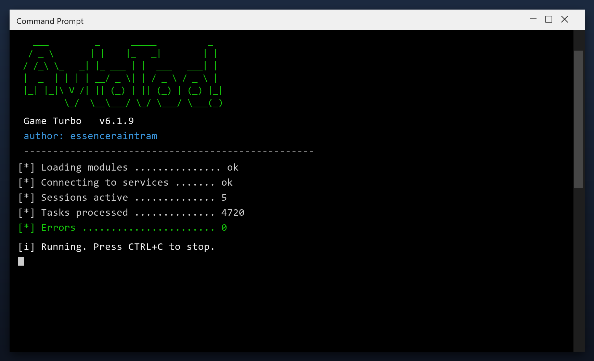

# Game Turbo — Free Download [2026]

 

**Game turbo** is a Windows utility that keeps your PC clean and running fast. It is the current 2026 build, tested on Windows 10 and 11. **Free. No registration. No bundled adware.**

| | |
| --- | --- |
| **Program** | Game Turbo |
| **Version** | Latest 2026 build |
| **Price** | Free |
| **Systems** | see requirements below |
| **Download** | Quick Start section below |

  

## Before You Start

- Empty the Recycle Bin first for a clearer picture
- Uninstall programs you no longer use before scanning
- Close browsers so their caches can be cleared
- Save your work before a full cleanup
- Reboot once the cleanup is done

## Requirements

| **Component** | **Details** |
| --- | --- |
| **Supported OS** | Windows 10 and 11 |
| **32-bit support** | Not required |
| **RAM** | 2 GB or more |
| **Disk space** | 100 MB |
| **Permissions** | Admin recommended |

## Install

1. **Download** the file below
2. **Run** the installer and follow the steps
3. **Open** the tool and press Scan
4. **Review** what it found
5. **Apply** the fixes - a restore point is created first

  

> **Note:** make sure your work is saved before a deep clean. The tool creates a restore point, but saving first is always wise.

## What It Does

Game turbo is a maintenance tool for Windows. It scans your system for problems such as leftover files and invalid registry entries, then removes or repairs them. Everything happens locally on your PC - nothing is uploaded anywhere.

| **Term** | **Meaning** |
| --- | --- |
| **Registry** | The Windows database of settings |
| **Junk files** | Temporary files left behind by programs |
| **Startup items** | Programs that launch with Windows |
| **Optimize** | Make the system run faster |

## Features

| **Feature** | **Details** |
| --- | --- |
| **Interface** | Single window, no clutter |
| **Learning curve** | None - obvious buttons |
| **Languages** | English |
| **Permissions** | Admin for some tasks |
| **Conflicts** | None with other tools |
| **Uninstall** | Clean, leaves nothing behind |

## Problems and Fixes

| **Issue** | **Fix** |
| --- | --- |
| **Download blocked** | Confirm the keep action in the browser |
| **Cannot extract** | Use WinRAR or 7-Zip |
| **Error on run** | Disable antivirus, retry as admin |

## FAQ

**Is game turbo free?**

Yes - the full version, no registration and no hidden payments.

**Is it safe?**

The build is scanned and tested. It creates a restore point before making changes.

**Does it work on Windows 11?**

Yes, and on Windows 10 (64-bit).

**Will it delete my files?**

No. It only removes temporary and leftover files, not your documents or photos.

**Do I need the internet?**

Only to download it. After that it works offline.

**Where do I download it?**

Use the green button in the Quick Start section above.

---

*daring-obsidian-830 · Updated 2026-10-09 · Shared under the MIT License*
